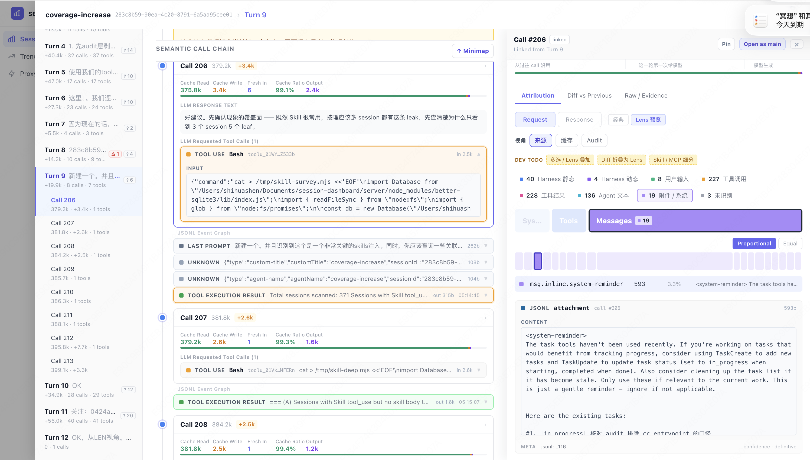

# session-devtools

[English](./README.md) · **简体中文**

> **Agent 驾驭 LLM。你驾驭 agent。**

[](LICENSE)
[](https://www.npmjs.com/package/session-devtools)
[](https://nodejs.org)

---

<!-- HERO: 15 秒自动循环 GIF，宽 800px，<5MB。镜头：session 列表 → turn drilldown → sub-agent 边界。 -->



▶ 观看完整 60 秒 demo → [Bilibili](https://www.bilibili.com/video/REPLACE_ID) · [YouTube](https://youtu.be/REPLACE_ID)

---

**Claude Code 是宇宙飞船。我们做的是驾驶舱。**

> "Claude Code 已经变成了一艘宇宙飞船，80% 的功能我根本用不到。基本上没有任何 harness 允许你检查与模型交互的每一个细节。"
>
> — Mario Zechner，[*What I learned building an opinionated and minimal coding agent*](https://mariozechner.at/posts/2025-11-30-pi-coding-agent/)

`session-devtools` 就是那个 harness。

> **Alpha** · 当前仅支持 Claude Code 2.x · 本地运行 · 数据不出本机。

---

## 隐藏的执行链路

你的终端只给你看最终回答。**产出它的过程，全程不可见。**

一次 Claude Code 的 turn 背后，往往藏着：

- 多次 **LLM call**
- 十几次 **tool call**
- 多个 **sub-agent** 在自己的上下文里探索
- 悄悄注入的指令
- 一次上下文压缩

**把它当作浏览器 DevTools —— 但针对 LLM 交互。**

点开任何一次 call，看到完整的上下文窗口，并且每一段都带来源标签：哪段 system prompt、哪个 tool result、哪一轮历史 turn 贡献了哪些 token。对比相邻两次 call，看清中间到底变了什么。从父 agent 到子 agent 再回来，每一次 sub-agent 委派都有完整链路。

不只是 *Claude 说了什么*，而是 *它在说这句话时，看到的是什么*。

---

## 一条命令

```bash
npx session-devtools
```

Node 22+。
自动在浏览器打开 [http://localhost:5173](http://localhost:5173)。**数据不上传。**

或者全局安装：

```bash
npm i -g session-devtools
session-devtools
```

---

## 你可以检查什么

| 能力 | 实际看到的内容 |
|---|---|
| **完整调用层级** | Session → Turn → LLM Call → Tool Call → Tool Result。每一层都是链接，不是日志行。 |
| **上下文归因** | 对任意一次 LLM call：上下文窗口里的每一段，都标注来源 —— system prompt block、tool result、注入的指令、之前的 turn。 |
| **Call 间 diff** | 相邻两次 LLM call 之间，准确看出新增和丢弃了什么。捕获悄悄注入的上下文。 |
| **Sub-agent 全链路** | 完整的父 → 子委派：父 agent 交付了什么、子 agent 实际跑了什么、什么结果回到主对话。 |
| **回答拆解** | 最终答案由哪些 content block 组成，顺序如何。 |

---

## 60 秒上手试一下

先把 `session-devtools` 跑起来。然后在任意你想分析的仓库里打开 Claude Code，输入：

```text
Use a subagent to inspect this repository and answer one question:
What are the three most important files in this codebase, and why?

Do not edit files. The subagent should return file paths and one-sentence reasons.
After it returns, summarize the answer in a short table.
```

跑完后切回 `session-devtools`，依次看：

- 父 agent **决定派单**的那次 LLM call
- 子 agent **自己的工具链**
- 结果**交回**父对话的那一刻
- 父 agent **下一次调用**的上下文从哪里来

跑完这一次，"sub-agent 到底是什么"就不再抽象了。

之后继续探索 —— 每一个 Claude Code 的“小把戏”都能被点开看清，就像你用 Chrome DevTools 探索喜爱的网页那样。

---

## CLI 参数

```
session-devtools --port <n>        # 默认 5173
                 --data-dir <path> # 默认 ~/.api-dashboard
                 --no-open         # 不自动打开浏览器
                 --quiet           # 静默日志
                 --no-proxy        # 跳过 MITM 代理安装（关闭归因）
```

---

## 上下文归因

**归因默认开启。** 首次启动时，`session-devtools` 会自动安装一个本地 MITM 代理，捕获 Claude Code 的出站请求 —— 这是实现"每段上下文都可归因"的基础。代理在本机运行，**不会有任何数据离开你的机器**。

它做的事：

1. 在 `~/.claude/settings.json` 中添加代理配置
2. 拦截后续 Claude Code session 的请求体
3. 与 session 数据一起本地存储

**首次启动后请重新开一个 Claude Code session** —— 已有的 session 没有请求数据，归因区域会显示 `Attribution requires proxy data`。

不想启用代理？

```bash
session-devtools --no-proxy
```

所有 session 的归因区域都会显示 `Attribution requires proxy data`。

---

## Alpha 阶段坦白

- **目前仅支持 Claude Code 2.x。** Codex / Gemini 暂未支持。
- **归因**需要 MITM 代理（首次启动自动安装，可用 `--no-proxy` 关闭）。
- **数据不上传云端。** 全部存放在本地 `~/.api-dashboard/sessions.db`。

---

## 运行要求

- Node.js v22+
- Claude Code（用于 session 数据）

Session 数据自动从 `~/.claude/projects/**/*.jsonl` 读取。
覆盖数据目录：`API_DASHBOARD_DIR=/your/path`。

发布新版本后，`session-devtools` 在下次启动时会打印升级提示。
升级命令：`npm i -g session-devtools@latest`。

---

## 开发

```bash
git clone https://github.com/tony-shi/session-devtools
cd session-devtools
npm install
npm run dev          # 同时启动 server 与 client，支持热更新
npm run build        # 生产构建（server + client）
npx tsc --noEmit     # 类型检查
cd client && npm run lint
```

---

## License

[MIT](LICENSE)

---

> **Agent 驾驭 LLM。你驾驭 agent。**

如果这个项目能帮到你，**点个 star**，在 [discussions](https://github.com/tony-shi/session-devtools/discussions) 里告诉我们你还想检查什么。
