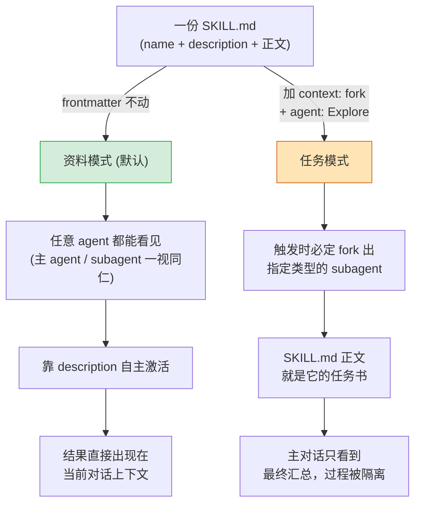

# Skill 模式认知图

## 对比表

| 维度 | 资料模式 | 任务模式 |
|------|---------|---------|
| **frontmatter 信号** | （无） | `context: fork` + `agent: <type>` |
| **激活方式** | description 自然语言匹配 | 用户显式 `/skill-name` |
| **执行宿主** | 当前 agent（主或子皆可） | 必定 fork 出的新 subagent |
| **能看到主对话吗** | 主 agent 是；subagent 否 | 否（独立上下文） |
| **结果落点** | 直接进入当前对话 | 仅返回摘要到主对话 |
| **适合场景** | 工具、规则、参考资料 | 重读+重输出的独立任务 |

## 一句话总结

**一份 SKILL.md，frontmatter 改两行，就从"货架上的工具"变成"独立执行的任务"。** 这就是 Claude Code skill 的全部模式空间。
